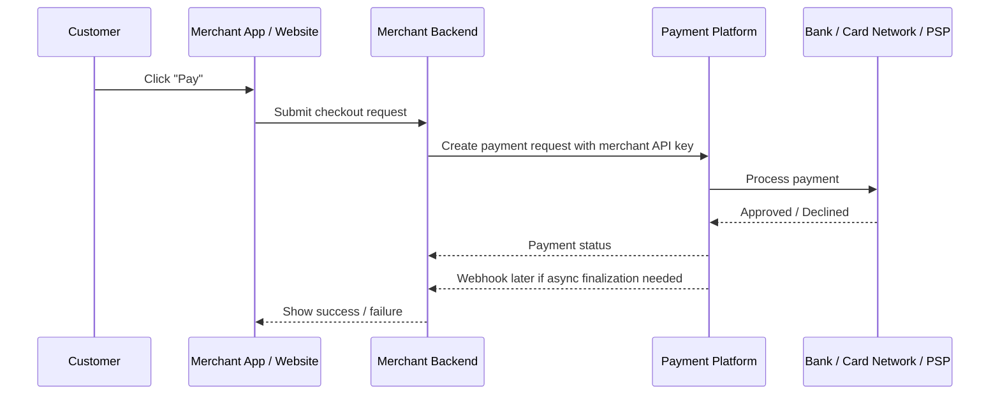
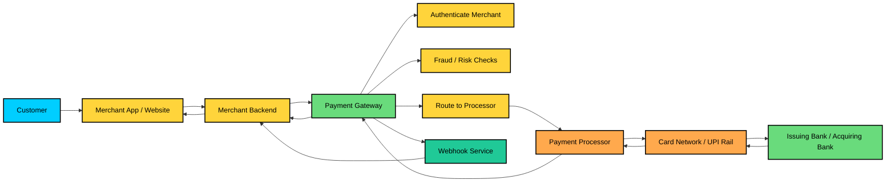

Yes, you are thinking about it the right way.

## Short answer

In a real checkout flow, the **customer does not usually talk directly to Stripe/Razorpay/Paytm/PhonePe**.

Most often the flow is:

1. **Customer places an order on a merchant site/app**
2. **Merchant backend creates a payment request**
3. Merchant backend sends that request to a **payment gateway / payment platform**
4. The payment platform talks to **external payment processors / banks / card networks**
5. Payment status comes back to the merchant via **response + webhook**

So when we say “design payment system,” we usually mean **the payment platform itself**, like **Stripe, Razorpay, Paytm payments, PhonePe payment stack, Braintree, Adyen**.

---

## Who is who?

### 1. Merchant
The business selling goods or services.

Examples:
- Amazon
- Flipkart
- Swiggy
- a SaaS app
- an online store

The merchant integrates with a payment provider to accept money.

### 2. Payment platform or gateway
This is the system we are designing in this lesson.

Examples:
- Stripe
- Razorpay
- Paytm payment gateway
- PhonePe payment gateway
- Braintree
- Adyen

This system:
- authenticates merchants
- accepts payment requests
- handles idempotency
- coordinates payment processing
- stores transaction state
- sends webhooks
- handles refunds, retries, reconciliation

### 3. External processor / network
These are downstream financial rails.

Examples:
- card processors
- acquiring banks
- issuing banks
- Visa / Mastercard networks
- UPI rails in India
- wallet providers
- bank transfer systems

The payment platform integrates with these.

---

## End-to-end flow

Here is the typical flow for an online purchase:

### What happens in practice
- The **customer** interacts with the **merchant app**
- The **merchant backend** talks to the **payment platform**
- The **payment platform** talks to external financial services
- The **merchant** updates order status based on the result

---

## So who makes the API call?

Usually, the **merchant backend** makes the API call to the payment platform.

Not the customer browser directly, because:
- API keys must stay secret
- payment logic needs server-side validation
- idempotency and fraud checks are safer on the backend

Sometimes a frontend app uses a **client token** or a **checkout SDK**, but even then the sensitive orchestration still happens through the merchant backend and payment platform.

---

## What if customer is entering card details?

There are two common patterns.

### Pattern 1: Merchant backend collects payment details indirectly
The merchant frontend sends data to its backend, then backend calls Stripe/Razorpay.

### Pattern 2: Hosted checkout or payment SDK
The merchant redirects the customer to a hosted payment page or uses a payment widget provided by the platform.

Examples:
- Stripe Checkout
- Razorpay Checkout
- Paytm hosted payment page

In this case:
- customer enters card details on the payment platform’s UI
- the merchant still initiates the flow
- the merchant still receives the final payment status

This reduces PCI burden on the merchant.

---

## What system are we designing here?

For this page, we are designing the **payment platform**, not the merchant app.

So think of it like:

- **Merchant system** = Amazon / Flipkart / a merchant website
- **Payment system** = Stripe / Razorpay / PhonePe / Paytm payments stack

The lesson is about how the **payment platform** works internally:
- API gateway
- payment service
- idempotency store
- workers
- ledger
- webhooks
- reconciliation

---

## Where do Amazon and Flipkart fit?

Amazon and Flipkart are usually **merchants or marketplaces** in this context.

They:
- initiate payment requests
- handle checkout UX
- store order state
- call payment providers
- listen to webhooks
- mark the order as paid after confirmation

If they run their own payment layer, that internal layer may resemble a payment platform, but in most interview contexts they are treated as the **merchant side**, not the external payment processor.

---

## Where do Paytm, PhonePe, Razorpay fit?

They are examples of the **payment provider side**.

They:
- authenticate merchants
- process transactions
- integrate with banks/networks
- send webhooks
- provide dashboards, refunds, reconciliation, reporting

So if the question is “design Razorpay,” then you are designing the **payment platform**.

If the question is “design checkout for Amazon,” then you are designing the **merchant checkout flow**, which includes calling a payment provider.

---

## Simple mental model

You can think of it like this:

- **Customer** pays
- **Merchant** asks for payment
- **Payment platform** processes it
- **Bank/network** moves the money
- **Merchant** gets notified

---

## Why the lesson mentions merchant API keys

Because the payment platform needs to know **which merchant is calling** and whether they are allowed to create payments.

So the merchant backend gets an API key from the payment platform, and uses it to create payment requests.

---

##

PCI here means **Payment Card Industry**, and in practice people usually mean **PCI DSS**.

### What is PCI DSS?

**PCI DSS** stands for **Payment Card Industry Data Security Standard**.  
It is a security standard that any system handling **credit card data** must follow.

Its goal is to protect cardholder data from:
- theft
- leaks
- unauthorized access
- misuse

### Why does this matter?

If a merchant directly handles card numbers, expiry dates, CVV, or similar sensitive card data, that merchant has to meet much stricter security requirements.

That can include things like:
- secure storage
- encryption
- access controls
- audit logging
- network segmentation
- security testing
- compliance audits

So when we say:

> “This reduces PCI burden on the merchant”

we mean:

> the merchant does not have to handle raw card data itself, so it has less compliance work and less security risk.

---

## Example

### High PCI burden
If the merchant collects and stores card details on its own backend, then:
- its servers become part of the sensitive card-data environment
- it must follow PCI DSS requirements
- a security mistake can be very costly

### Lower PCI burden
If the merchant uses a hosted checkout page or payment SDK from Stripe/Razorpay/Paytm:
- card data goes directly to the payment provider
- the merchant receives only a **token** or payment confirmation
- the merchant’s system never sees the raw card number

That means the merchant has much less PCI scope.

---

## Important concept: tokenization

Usually the payment provider replaces the real card data with a **token**.

So instead of storing:

- card number
- CVV
- expiry date

the merchant stores something like:

- `payment_method_token = tok_abc123`

That token is useless outside the payment provider’s system, which is much safer.

---

## Simple way to remember it

- **PCI** = security rules for card data
- **PCI DSS** = the standard
- **Lower PCI burden** = less card data handled by the merchant

If you want, I can also explain:
1. **what PCI scope means**, or  
2. **why CVV should never be stored**.

## In one line

We are building the **Stripe/Razorpay/Paytm-like payment system**, while **Amazon/Flipkart-like businesses** are the merchants that integrate with it.

If you want, I can draw the full **merchant-side vs payment-platform-side architecture** with a clean Mermaid diagram.

##

No, they are **not exactly the same**.

## Simple difference

### Payment gateway
The **gateway** is the layer that receives a merchant’s payment request and routes it, validates it, and often hides processor-specific complexity.

Think of it as the **front door + translator**.

### Payment processor
The **processor** is the service that actually talks to the banking/card infrastructure to move or authorize money.

Think of it as the **entity doing the financial work**.

---

## In a real flow

A merchant sends a payment request to a gateway like Razorpay or Stripe.

Then the gateway may:
- validate the request
- apply fraud checks
- choose a processor
- retry if needed
- normalize responses
- send webhooks

The gateway then connects to one or more processors, which may interact with:
- card networks
- banks
- UPI rails
- wallet systems

---

## Why people confuse them

In many products, one company offers **both** roles in one platform.

For example:
- Stripe can act like a gateway and also handle processing orchestration
- Razorpay often does gateway-like orchestration and processor integration
- Paytm / PhonePe can similarly provide the merchant-facing payment layer

So in conversation, people sometimes say “gateway” and “processor” loosely, but conceptually they are different.

---

## Easy analogy

If you order food:

- **Gateway** = the app that takes your order, checks it, and sends it to the kitchen
- **Processor** = the kitchen that actually prepares the food

---

## In payment system design interviews

Usually we separate them like this:

- **Payment gateway** = merchant-facing orchestration layer
- **Payment processor** = external financial network or provider that actually executes the payment

This is also why the lesson mentions a **PSP Gateway** or **Payment Processor Gateway** as an abstraction layer. It sits between your internal service and external processors.

---

## Practical example

Suppose a merchant uses Razorpay.

- Merchant backend calls Razorpay
- Razorpay authenticates the merchant
- Razorpay decides how to route the payment
- Razorpay talks to bank/card/UPI rails
- Razorpay returns status to the merchant

In this setup, Razorpay is acting as the **gateway**, and the bank/network side is the **processor**.

---

## One-line summary

**Gateway = routes and orchestrates payments.  
Processor = actually processes the payment with financial networks.**

If you want, I can also draw a **gateway vs processor vs bank** diagram to make the flow super clear.

## 

Absolutely. Here is the end-to-end picture.

## How to read this

The flow usually starts with the **customer** on the merchant’s site or app. The **merchant backend** creates or initiates the payment request. That request goes to the **payment gateway**, which authenticates the merchant, applies risk checks, and decides where to send the payment.

The **payment processor** then talks to the actual financial rails, such as card networks or UPI infrastructure, and the result comes back through the gateway to the merchant. In many cases, the final confirmation is also sent later through a **webhook**.

## Key idea

- **Merchant** = the business accepting payment
- **Gateway** = the orchestrator and entry point
- **Processor** = the system that actually executes the payment with banks and networks

If you want, I can also give you:
1. a **sequence diagram** of the same flow, or
2. a **merchant-side vs Stripe-side architecture** diagram.
